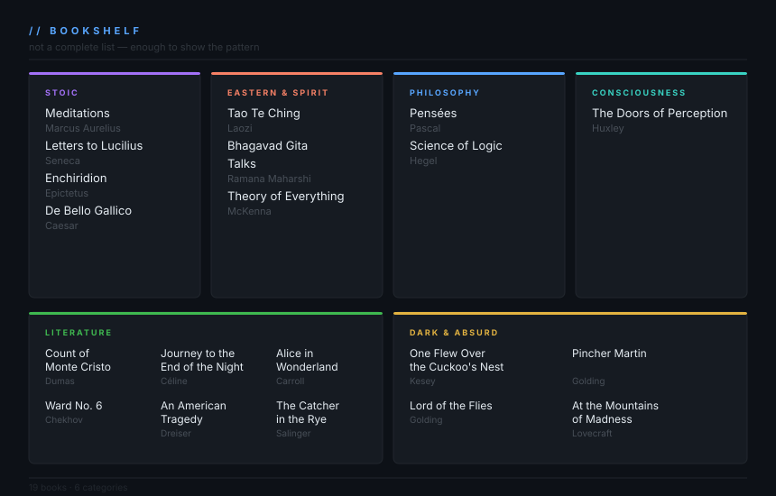

<div align="center">

# `makepkg`

*operator &nbsp;·&nbsp; builder &nbsp;·&nbsp; signal hunter*

🇬🇧 &nbsp;&nbsp; 🇷🇺 &nbsp;&nbsp; 🇺🇦

</div>

---

```
// cogito ergo sum
const makepkg = {
  typeof:      "contextual — works as intended",
  stack:       "firmware meets philosophy. post-punk meets practice.",
  env:         "high-interference environments · uptime: relative",
  signal:      "persistent · hardened 🇺🇦",
  tools:       "standard issue — and otherwise",
  rebuild:     () => "lifestyle, not a recovery plan"
}
```

---

## `// ARCHITECTURE`

> One root. Three branches. All running in parallel.

<details>
<summary><b>⚙ Technical</b> &nbsp;—&nbsp; system · code · radio · hardware</summary>

<br>

<details>
<summary>&nbsp;&nbsp;&nbsp;🖥 &nbsp;<b>System & Linux</b></summary>

<br>

| | Skill | Notes |
|:---:|---|---|
| 🟢 | **Arch Linux** | pacman · AUR · systemd · ricing |
| 🔵 | Ubuntu | server · deployment |
| 🟢 | **Automation** | n8n · bash · cron · shell pipelines |
| 🔵 | Security / OPSEC | hardening · OSINT · recon |
| 🔵 | WordPress | deployment · configuration |

</details>

<details>
<summary>&nbsp;&nbsp;&nbsp;💻 &nbsp;<b>Programming</b></summary>

<br>

| | Skill | Notes |
|:---:|---|---|
| 🟢 | **Bash** | scripting · automation · glue |
| 🔵 | Python | tooling · data · automation |
| 🔵 | JavaScript | frontend · scripting |
| 🟡 | C / C++ | embedded · low-level |

</details>

<details>
<summary>&nbsp;&nbsp;&nbsp;📡 &nbsp;<b>Radio & Embedded</b></summary>

<br>

| | Skill | Notes |
|:---:|---|---|
| 🔵 | **RF / SDR** | signal analysis · UHF/VHF · protocol decoding |
| 🔵 | **ESP32 / Embedded** | radio protocols · sensors · IoT |
| 🔵 | **Raspberry Pi** | module integration · headless setups |
| 🟡 | Analog circuits | passives · schematics · board-level repair |
| 🟡 | Analog radio | FM/AM · receiver design · vintage hardware |

</details>

<br>

</details>

---

<details>
<summary><b>◈ Creative</b> &nbsp;—&nbsp; music · art · language</summary>

<br>

<details>
<summary>&nbsp;&nbsp;&nbsp;🎸 &nbsp;<b>Music</b></summary>

<br>

| | Skill | Notes |
|:---:|---|---|
| 🟢 | **Post-punk composition** | production · arrangement · texture |
| 🟢 | **Guitar performance** | electric · live |
| 🔵 | Vocals / singing | |

</details>

<details>
<summary>&nbsp;&nbsp;&nbsp;🖋 &nbsp;<b>Writing & Visual Art</b></summary>

<br>

| | Skill | Notes |
|:---:|---|---|
| 🟢 | **Poetry** | EN · RU · UA — unfiltered |
| 🔵 | Painting & drawing | |
| 🔵 | Photography | |
| 🟡 | Typewriter restoration | mechanical repair · object poetry |

</details>

<br>

</details>

---

<details>
<summary><b>◉ Inner Arch</b> &nbsp;—&nbsp; philosophy · consciousness · inquiry</summary>

<br>

| | Domain | Notes |
|:---:|---|---|
| 🟢 | **Advaita Vedanta** | non-dual inquiry · self-study |
| 🔵 | Philosophy | Hegel · Pascal · Descartes · applied logic |
| 🔵 | **Dialectical thinking** | thesis · antithesis · synthesis · lived practice |
| 🔵 | Stoic practice | Marcus Aurelius · Epictetus · Seneca · discipline |
| 🔵 | Consciousness research | expanded states · entheogenic cartography · integration |
| 🔵 | Literature | classical · raw · dense |
| 🟡 | Languages | EN · RU · UA — think in all three |

<br>

</details>

<br>

> `🟢` core / fluent &nbsp;&nbsp; `🔵` strong &nbsp;&nbsp; `🟡` solid &nbsp;&nbsp; `⚪` exploring

---

## `// STACK`
<div align="center">

| 🖥 &nbsp;System | 💻 &nbsp;Languages | ⚡ &nbsp;Automation |
|:---:|:---:|:---:|
|   <br>   |   <br>   |  <br>   |
| **🌐 &nbsp;Web** | **📡 &nbsp;Hardware & RF** | **🔒 &nbsp;Security** |
|   <br>  |   <br>   |   <br>  |
| **🎬 &nbsp;Video** | **🎵 &nbsp;Audio** | **🖼 &nbsp;Graphics** |
|  |  |  |

</div>

---

<p align="center">
  
</p>

---

## `// STATUS`

<div align="center">


&nbsp;

&nbsp;

&nbsp;

&nbsp;

&nbsp;

&nbsp;

</div>

---

<div align="center">
<sub><code>makepkg</code> &nbsp;·&nbsp; EN · RU · UA &nbsp;·&nbsp; // all frequencies, one operator</sub>
</div>
